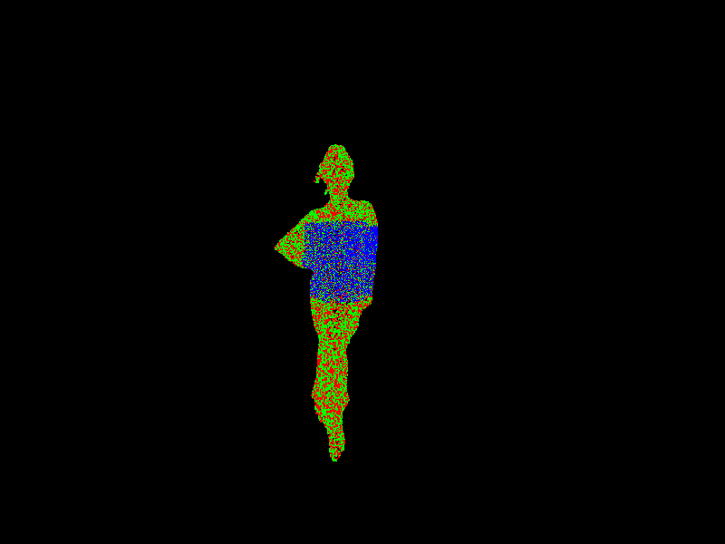

# RUN: A Case for Cross-Layer Networked Virtual Reality

## Supplementary Page

This page provides supplemental visualization results for the paper **"RUN: A Case for Cross-Layer Networked Virtual Reality."**

The figures below demonstrate the impact of Head-of-Line (HoL) blocking across different datasets.  
Each row shows:
- The original reference dataset
- The output under HoL blocking
- The expected output without HoL blocking

Point clouds are color-coded every level to indicate rendering coverage.

---

## Dataset: Plane [1]

<table>
  <tr align="center">
    <td></td>
    <td></td>
    <td></td>
  </tr>
  <tr align="center">
    <td>Original</td>
    <td>with HoL blocking(10,330 pts)</td>
    <td>without HoL (16,000 pts)</td>
  </tr>
</table>

---

## Dataset: Tikal [2]

<table>
  <tr align="center">
    <td></td>
    <td></td>
    <td></td>
  </tr>
  <tr align="center">
    <td>Original</td>
    <td>with HoL blocking (10,736 pts)</td>
    <td>without HoL blocking (18,969 pts)</td>
  </tr>
</table>

---

## Dataset: Guanyin [3]

<table>
  <tr align="center">
    <td></td>
    <td></td>
    <td></td>
  </tr>
  <tr align="center">
    <td>Original</td>
    <td>with HoL blocking (15,495 pts)</td>
    <td>without HoL blocking (37,495 pts)</td>
  </tr>
</table>

---

## Dataset: CA21 [4]

<table>
  <tr align="center">
    <td></td>
    <td></td>
    <td></td>
  </tr>
  <tr align="center">
    <td>Original</td>
    <td>with HoL blocking (21,442 pts)</td>
    <td>without HoL blocking (31,310 pts)</td>
  </tr>
</table>

---

## Dataset: longdress [5]

<table>
  <tr align="center">
    <td></td>
    <td></td>
    <td></td>
  </tr>
  <tr align="center">
    <td>Original</td>
    <td>with HoL blocking (19,461 pts)</td>
    <td>without HoL blocking (28,015 pts)</td>
  </tr>
</table>

---

## Dataset: soldier [5]

<table>
  <tr align="center">
    <td></td>
    <td></td>
    <td></td>
  </tr>
  <tr align="center">
    <td>Original</td>
    <td>with HoL blocking (16,461 pts)</td>
    <td>without HoL blocking (27,216 pts)</td>
  </tr>
</table>

## References
[1] Open3D. *Custom Point Cloud Dataset Generated via Open3D*. Open3D Library.  
https://www.open3d.org

[2] Point Clouds. *Point Clouds: 3D Models – Tikal, Guatemala*. Sketchfab.  
https://sketchfab.com/3d-models/tikal-guatemala-68e7e87ee8664745909518e7b579d3b4

[3] M.P. Bunds, C. Scott, B. Whitney, and V.J.C. Lee. *High Resolution Topography of the Southern San Andreas Fault from Painted Canyon to Bombay Beach, USA*. 2021.  
Distributed by OpenTopography. https://doi.org/10.5069/G94M92RG

[4] Point Clouds. *Point Clouds: 3D Models – 12th-c CE Water Moon Guanyin*. Sketchfab.  
https://sketchfab.com/3d-models/12th-c-ce-water-moon-guanyin-f3316610c8b740c595c22ca1d7df54ca

[5] Maja Krivokuca, Philip A. Chou, and Patrick Savill. *8i Voxelized Surface Light Field (8iVSLF) Dataset*.  
ISO/IEC JTC1/SC29/WG11 MPEG, input document M42914, 2018.
