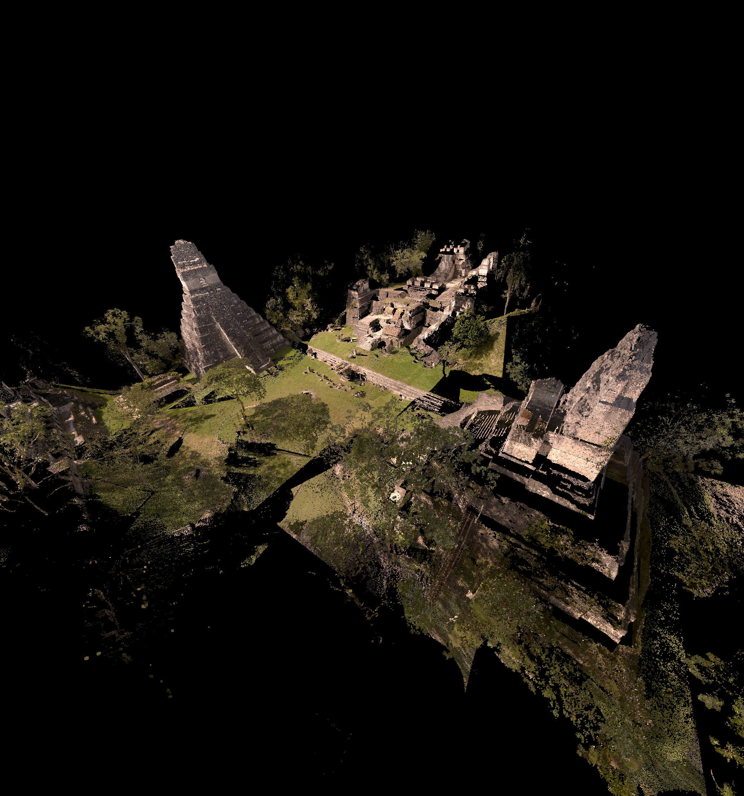

# RUN: A Case for Cross-Layer Networked Virtual Reality

## Supplementary Page

This page provides supplemental visualization results for the paper **"RUN: A Case for Cross-Layer Networked Virtual Reality."**

The figures below demonstrate the impact of Head-of-Line (HoL) blocking across different datasets.  
Each row shows:
- The original reference dataset
- The output under HoL blocking
- The expected output without HoL blocking

Point clouds are color-coded every level to indicate rendering coverage.

---

## Dataset: Plane

<table>
  <tr align="center">
    <td></td>
    <td></td>
    <td></td>
  </tr>
  <tr align="center">
    <td>Original</td>
    <td>with HoL (10,330 pts)</td>
    <td>without HoL (16,000 pts)</td>
  </tr>
</table>

---

## Dataset: Tikal

<table>
  <tr align="center">
    <td></td>
    <td></td>
    <td></td>
  </tr>
  <tr align="center">
    <td>Original</td>
    <td>with HoL (10,736 pts)</td>
    <td>without HoL (18,969 pts)</td>
  </tr>
</table>

---

## Dataset: Guanyin

<table>
  <tr align="center">
    <td></td>
    <td></td>
    <td></td>
  </tr>
  <tr align="center">
    <td>Original</td>
    <td>with HoL (15,495 pts)</td>
    <td>without HoL (37,495 pts)</td>
  </tr>
</table>

---

## Dataset: CA21

<table>
  <tr align="center">
    <td></td>
    <td></td>
    <td></td>
  </tr>
  <tr align="center">
    <td>Original</td>
    <td>with HoL (21,442 pts)</td>
    <td>without HoL (31,310 pts)</td>
  </tr>
</table>

---

## Dataset: longdress

<table>
  <tr align="center">
    <td></td>
    <td></td>
    <td></td>
  </tr>
  <tr align="center">
    <td>Original</td>
    <td>with HoL (19,461 pts)</td>
    <td>without HoL (28,015 pts)</td>
  </tr>
</table>

---

## Dataset: soldier

<table>
  <tr align="center">
    <td></td>
    <td></td>
    <td></td>
  </tr>
  <tr align="center">
    <td>Original</td>
    <td>with HoL (16,461 pts)</td>
    <td>without HoL (27,216 pts)</td>
  </tr>
</table>
